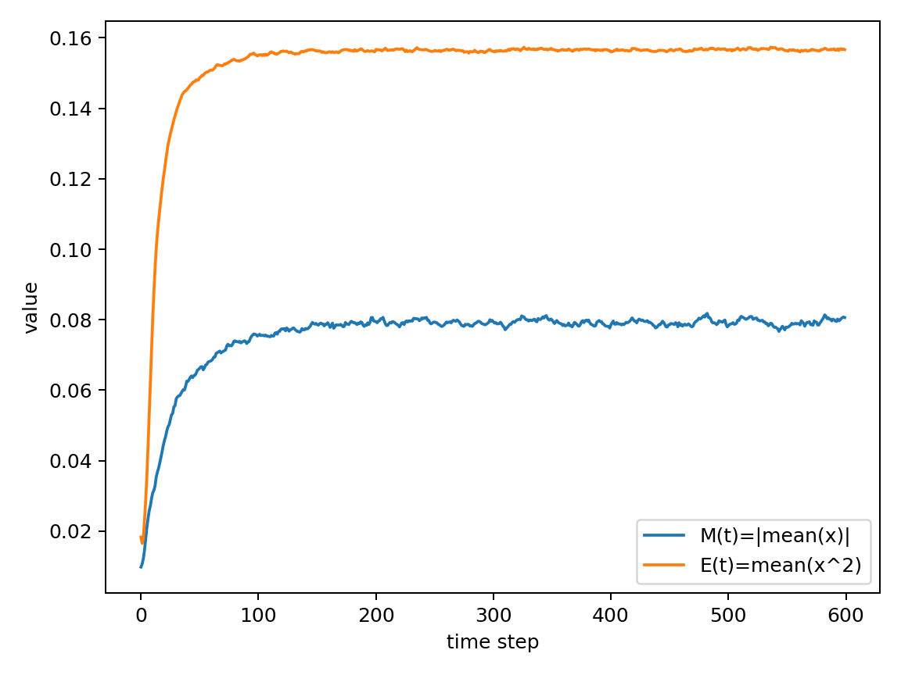
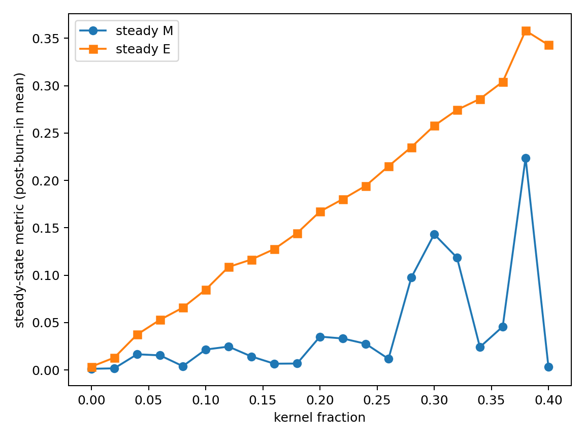

# Social Oscillation Model  
**Emergence of self-excitation in communication-mediated social networks**

This project proposes a minimal computational model to explore how self-excitation and synchronization emerge in text-based communication environments, such as social media.

---

## Core Hypothesis

In large-scale communication-mediated social systems, collective instability is determined not **solely** by network topology or information flow, but also by the **distribution of heterogeneous individual traits** within the population.

Specifically:

- A subset of individuals acts as **self-exciting “kernel” agents**.
- The remainder of the population behaves as **passive or non-self-exciting agents**.
- As the fraction of kernel agents increases, the system undergoes a **regime shift** from a stable state to synchronized, oscillatory, or unstable dynamics.

This suggests that collective polarization or runaway behavior can be interpreted as a **phase-transition-like phenomenon** driven by population composition, rather than being exclusively triggered by external shocks or ideological shifts.

---

## What the model does

The repository contains a minimal agent-based network simulation that:

1. Creates a random interaction network.
2. Assigns a fraction of agents as self-exciting kernels.
3. Simulates time evolution of agent states under mutual influence.
4. Computes key observables:
   - Mean activity (order parameter)
   - System energy (variance-like measure)
5. Sweeps the kernel fraction to observe regime transitions.

---

## Research Intent

The model serves as:

- **A conceptual minimal model**, prioritizing theoretical clarity over high-fidelity social realism.
- **A bridge** between:
  - network science,
  - epidemic-like cascade models,
  - and control-theoretic concepts of self-excitation.
- **A theoretical foundation** for exploring stabilization strategies, such as:
  - intentional decoupling of highly sensitive nodes,
  - low-pass filtering within social feedback loops.

---

## Run

~~~bash
pip install -r requirements.txt
python simulation.py
~~~

---

## Parameters (implementation-level)

Key parameters in `simulation.py`:

- `--n`: number of agents
- `--steps`: number of timesteps
- `--edge-p`: interaction density (Erdos–Renyi edge probability)
- `--kernel-frac`: fraction of self-exciting kernel agents (single run)
- `--noise-std`: stochasticity level
- `--inertia`: persistence of the current state (higher = slower response)
- `--gamma`: extreme amplification exponent (higher = stronger emphasis on extreme neighbor states)
- `--burnin`: fraction of early timesteps discarded in sweep when computing steady-state averages

**Kernel agents (definition):** agents with **high internalization gain**, **low damping**, and **lower saturation threshold** relative to the base population.

---

## Results (how to read the outputs)

The script reports two observables:

- **M(t) = |mean(x)|**: an order parameter capturing global alignment / polarization.
- **E(t) = mean(x²)**: an “energy-like” measure of overall excitation.

In sweep mode, the steady-state values are computed as post-burn-in averages:
- `steady_M = mean(M[t >= burnin])`
- `steady_E = mean(E[t >= burnin])`

**Operational regime shift (practical criterion):**  
A regime shift is indicated when steady-state metrics (e.g., `steady_E` and/or `steady_M`) show a sharp increase as `kernel fraction` increases, suggesting transition to a synchronized / oscillatory / high-excitation regime.

---

## Limitations

- This is a **conceptual minimal model**, not a high-fidelity social simulator.
- The network is currently **Erdos–Renyi random graph** (no community structure / scale-free topology by default).
- The mapping between timesteps and real-world time is **not specified** (dimensionless dynamics).
- “Kernel agents” are an abstract construct representing a cluster of traits, not a demographic category.

---

## Outputs

Outputs are saved in `./out/`:

- `timeseries.png`  
  (time evolution of mean activity and system energy)
- `sweep_kernel_fraction.png`  
  (steady-state metrics vs. kernel fraction)

### Example outputs

**Time series (M(t), E(t))**

**Sweep: kernel fraction vs steady-state metrics**

---

## Companion project

A stabilization proposal based on intentional decoupling / low-pass filtering:

- (planned) `social-lpf` (separate repository)

---

## License

MIT (see LICENSE).

---

## How to cite

See `CITATION.cff` (works with GitHub citation UI).

---

---

# 日本語版概要

## Social Oscillation Model  
**コミュニケーション媒介型社会ネットワークにおける自己励起の創発モデル**

本プロジェクトは、SNSなどのテキスト中心のコミュニケーション環境において、  
**自己励起（self-excitation）と同期現象がどのように発生するか**を探るための、  
最小構成の計算モデルを提案するものです。

---

## 中心仮説（Core Hypothesis）

大規模なコミュニケーション媒介型社会システムにおける集団的不安定性は、  
ネットワーク構造や情報伝播だけで決まるのではなく、  
**集団内に分布する個体特性の構成**によっても決定される。

具体的には：

- 一部の個体は **自己励起的な「カーネル」エージェント**として振る舞う
- 残りの個体は **受動的、または非自己励起的なエージェント**として振る舞う
- カーネル個体の割合が増加すると、
  - 安定状態
  - 同期状態
  - 振動状態
  - 不安定状態
 へと **レジーム転移（相転移的変化）**が起こる

このことは、社会的分極化や暴走的現象が  
外的ショックやイデオロギーだけでなく、  
**集団の構成そのものによって相転移的に発生し得る**ことを示唆する。

---

## モデルの概要

このリポジトリには、以下を行う最小構成のエージェントベース・ネットワークシミュレーションが含まれています。

1. ランダムな相互作用ネットワークを生成
2. 一定割合の個体を自己励起カーネルとして設定
3. 相互影響のもとで時間発展をシミュレーション
4. 主要な観測量を計算：
   - 平均活動量（秩序変数）
   - システムエネルギー（分散的指標）
5. カーネル割合を掃引し、レジーム変化を観察

---

## 研究上の位置づけ

本モデルは：

- **概念的な最小モデル**
  - 社会の高精度再現よりも理論的明瞭さを重視
- 以下を橋渡しする理論的基盤：
  - ネットワーク科学
  - 感染・カスケードモデル
  - 制御理論における自己励起系
- 将来的な安定化手法の基盤：
  - 高感度ノードの意図的デカップリング
  - 社会的フィードバックループへのローパスフィルタ導入

---

# 日本語補足

## パラメータ（実装レベル）

`simulation.py` の主要パラメータ：

- `--n`：エージェント数
- `--steps`：時間ステップ数
- `--edge-p`：相互作用密度（Erdos–Renyi の辺生成確率）
- `--kernel-frac`：自己励起カーネル個体の割合（single実行時）
- `--noise-std`：ノイズ強度
- `--inertia`：状態の慣性（大きいほど応答が遅い）
- `--gamma`：極端値増幅の指数（大きいほど極端な近傍状態が強調される）
- `--burnin`：sweep時に定常評価から除外する序盤割合（0〜1）

**カーネル個体の定義：**  
ベース集団に比べて **影響の受けやすさ（internalization）が高く**、**自己減衰（damping）が弱く**、**サチュレーション閾値が低い** 個体として実装されています。

---

## 結果の読み方（出力の解釈）

本モデルでは次の観測量を出します：

- **M(t) = |mean(x)|**：集団の平均的な偏り（同期・分極の指標）
- **E(t) = mean(x²)**：系全体の興奮度（活動量・エネルギー的指標）

sweepでは burn-in 以降の平均を定常値として扱います：
- `steady_M = mean(M[t >= burnin])`
- `steady_E = mean(E[t >= burnin])`

**レジーム転移（暫定的な操作的定義）：**  
`kernel fraction` の増加に伴って `steady_E` や `steady_M` が急増する領域を、同期／振動／高興奮状態への移行（レジーム変化）として扱います。

---

## 限界（現段階）

- **概念的最小モデル**であり、高精度な社会再現を目的としていません。
- ネットワークは現状 **Erdos–Renyi ランダムグラフ**（コミュニティ構造等は未導入）。
- 時間ステップは **実時間と対応づけていない**（無次元）。
- “カーネル個体”は特定属性集団ではなく、複数特性の抽象化です。

---

## 関連プロジェクト

社会的振動の安定化を目的とした続編プロジェクト：

- （予定）`social-lpf`
